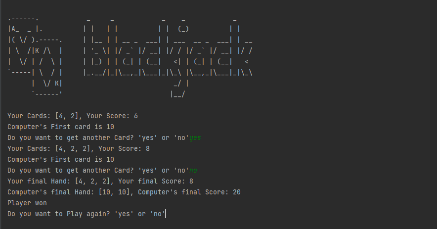

# Blackjack Game

## About the Game:
### In Blackjack, players are each dealt two cards and the dealer is also dealt two cards, normally one up (exposed) and one down (hidden). If a player thinks he can go for one more card without exceeding 21 then he goes for it.
### Once all the players have completed their hands, it is the dealer's turn. The dealer hand will not be completed if all players have either busted(exceeded score of 21) or received blackjacks(perfect score of 21). The dealer then reveals the hidden card. If the dealer and player both have the same score, then it's a draw. If the player has a blackjack, then the player wins. If the dealer has a blackjack, then the dealer wins. If the player score is over 21, then the player loses. If the dealer score is over 21, then the dealer loses. If none of the above, then the player with the score nearest to 21 wins

## Brief Summary of this project
### Being the First Capstone Project, This Project Came up it's own Challenges. I had to implement all the concepts I have Learned till now. It also had very complex logic which was very hard to implement. I will be honest, It took me a numerous amount of tries to finally come up with this implementation.
### In the end after accomplishing this challenge I felt very proud about myself.

